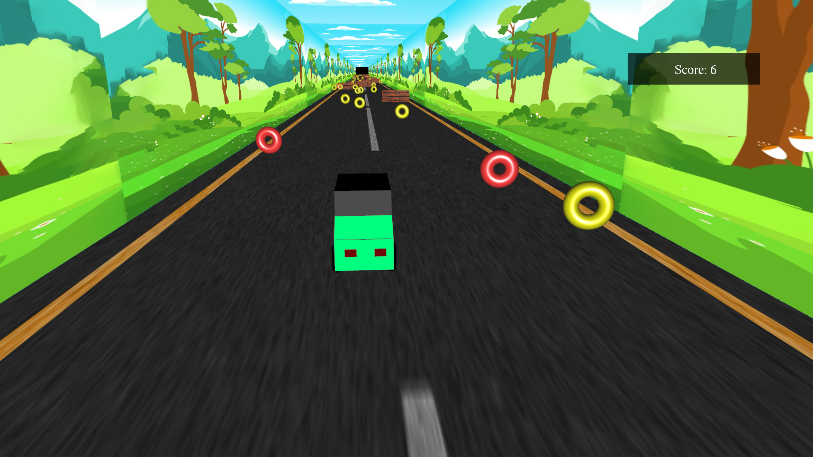
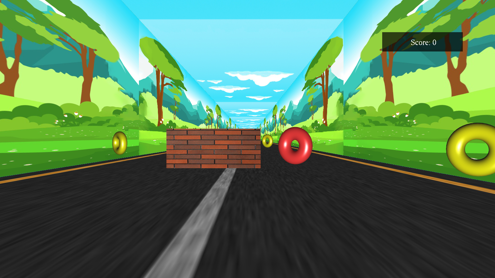
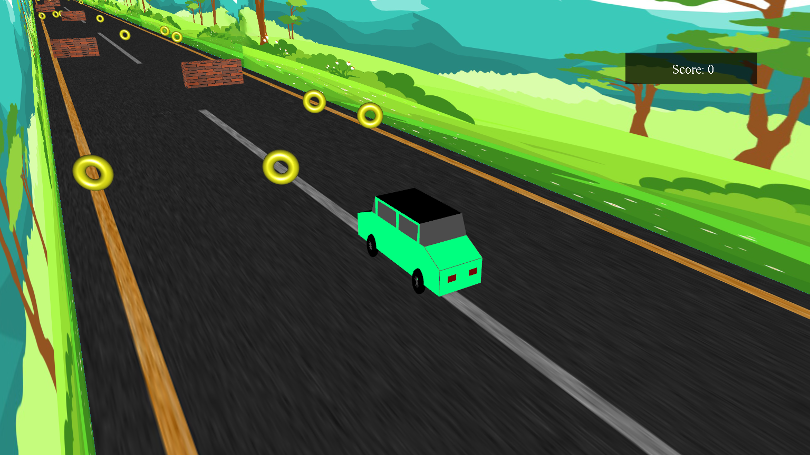
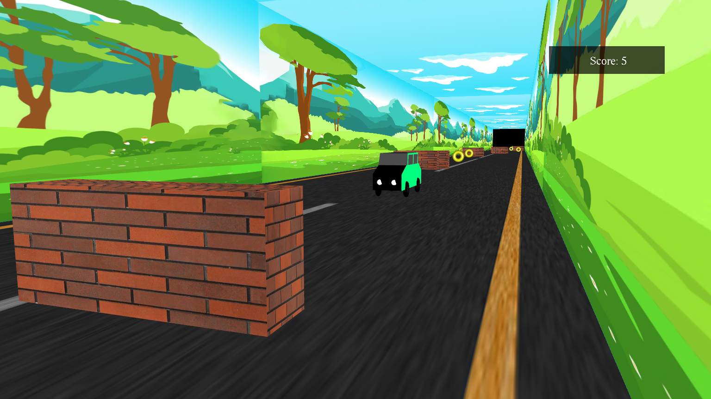
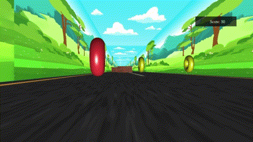

<div align="center">

# 3D Car Game

**A 3D car game built with C++, OpenGL, and GLUT — dodge obstacles, collect coins, and chase the high score.**




</div>

[**More images for preview**](#-preview)

---

## ✨ Features

- 🎮 3D graphics rendered in real-time using OpenGL
- 🚧 Randomly generated obstacles for endless challenge
- 🪙 Coin collection with score tracking
- 💡 Dynamic lighting and textures
- 🔊 Sound effects via SDL2_mixer

---

## ⬇️ Download & Play

Go to the [**Latest Release**](https://github.com/smoawad66/3d-car-game-glut/releases/latest) page and download the game for your platform.

---

## 🎮 Controls

### 🚗 Car Movement

| Key | Action |
|-----|--------|
| `W` | Move forward |
| `S` | Move backward |
| `D` | Move right |
| `A` | Move left |

### 📷 Camera

| Input | Action |
|-------|--------|
| `+` | Zoom in (camera closer) |
| `-` | Zoom out (camera further) |
| `Home` | Reset camera to default position |
| `Mouse drag` | Pan camera left / right / up / down |

---

## 🔧 Building from Source

### Prerequisites

| Dependency | Version |
|------------|---------|
| CMake | ≥ 3.10 |
| C++ compiler | C++17 support |
| OpenGL | any |
| FreeGLUT | any |
| SDL2 | any |
| SDL2_mixer | any |

---

## 🐧 Linux
 
**1. Install dependencies for your distro:**
 
### Arch Linux:
```bash
sudo pacman -S cmake gcc freeglut sdl2 sdl2_mixer
```
 
### Debian / Ubuntu:
```bash
sudo apt update
sudo apt install cmake g++ freeglut3-dev libsdl2-dev libsdl2-mixer-dev
```
 
### Fedora:
```bash
sudo dnf install cmake gcc-c++ freeglut-devel SDL2-devel SDL2_mixer-devel
```
 
**2. Clone, build, and run:**
 
```bash
git clone https://github.com/smoawad66/3d-car-game-glut.git
cd 3d-car-game-glut
cmake -B build -DCMAKE_BUILD_TYPE=Release
cmake --build build
./build/car_game
```
 
---

### 🪟 Windows

#### Option A — Download the release (recommended)
See the [**Download & Play**](#️-download--play) section above.

#### Option B — Build with Visual Studio + vcpkg

```powershell
# 1. Install dependencies via vcpkg
vcpkg install freeglut sdl2 sdl2-mixer --triplet x64-windows

# 2. Clone the repository
git clone https://github.com/smoawad66/3d-car-game-glut.git
cd 3d-car-game-glut

# 3. Configure CMake with vcpkg toolchain
cmake -B build `
  -DCMAKE_BUILD_TYPE=Release `
  -DCMAKE_TOOLCHAIN_FILE="C:/vcpkg/scripts/buildsystems/vcpkg.cmake"

# 4. Build
cmake --build build --config Release

# 5. Run
.\build\Release\car_game.exe
```

> **Note:** Make sure `vcpkg` is installed and integrated. See the [vcpkg docs](https://github.com/microsoft/vcpkg#getting-started) to get started.

---

## 🗂️ Project Structure

```
3d-car-game-glut/
├── assets/
│   ├── sounds/
│   │   ├── car-crash.wav
│   │   ├── celebration.wav
│   │   ├── coin.wav
│   │   ├── game-exit.wav
│   │   ├── game-start.wav
│   │   ├── gameover.wav
│   │   ├── menu-selection.wav
│   │   └── special-coin.wav
│   ├── textures/
│   │   ├── blu-sky.bmp
│   │   ├── obstacle.bmp
│   │   ├── road.bmp
│   │   ├── sky.bmp
│   │   ├── summer-scene.bmp
│   │   ├── win.bmp
│   │   └── win2.bmp
│   ├── icon.ico
│   ├── icon.png
│   └── resources.rc
├── images/
│   ├── car-game-1.png
│   ├── car-game-2.png
│   ├── car-game-3.png
│   ├── car-game-4.png
│   └── car-game-5.gif
├── include/
│   ├── Car.h
│   ├── Coin.h
│   ├── Menu.h
│   ├── Road.h
│   ├── SoundEngine.h
│   ├── stb_image.h
│   ├── Utils.h
│   └── Wall.h
├── src/
|   ├── Car.cpp
|   ├── Coin.cpp
|   ├── main.cpp
|   ├── Menu.cpp
|   ├── Road.cpp
|   ├── SoundEngine.cpp
|   ├── Utils.cpp
|   └── Wall.cpp
├── .gitattributes
├── .gitignore
├── CMakeLists.txt
└── README.md

```

---

## 📸 Preview

<div align="center">
  <table>
    <tr>
      <td></td>
      <td></td>
    </tr>
    <tr>
      <td></td>
      <td></td>
    </tr>
  </table>
</div>

---

## 🤝 Contributing

Pull requests are welcome. For major changes, please open an issue first to discuss what you'd like to change.
